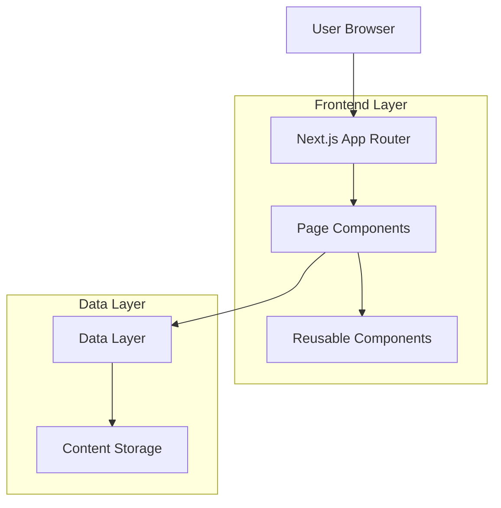

# Design Document: BudgetYatra Travel Blog

## Overview

BudgetYatra is a budget-focused travel blog website for exploring destinations across India. Built with Next.js 16 and Tailwind CSS 4, the application provides a modern, SEO-optimized platform for users to discover destinations, read travel blogs, and plan trips based on budget constraints and seasonal preferences.

### Core Objectives

- Provide an intuitive browsing experience for travel content
- Enable budget-based filtering and search functionality
- Deliver fast, SEO-optimized pages with excellent performance
- Support responsive design across all device sizes
- Facilitate user engagement through newsletters and social sharing

### Technology Stack

- **Framework**: Next.js 16.1.6 (App Router)
- **UI Library**: React 19.2.3
- **Styling**: Tailwind CSS 4
- **Language**: JavaScript (ES6+)
- **Deployment**: Vercel (recommended) or any Node.js hosting
- **Content Storage**: File-based (JSON/Markdown) or headless CMS integration

## Architecture

### High-Level Architecture

The application follows a modern JAMstack architecture with server-side rendering (SSR) and static site generation (SSG) capabilities provided by Next.js.



### Application Structure

```
src/
├── app/                          # Next.js App Router pages
│   ├── layout.js                 # Root layout with Navbar/Footer
│   ├── page.js                   # Homepage
│   ├── blogs/
│   │   ├── page.js              # Blog listing page
│   │   └── [slug]/
│   │       └── page.js          # Individual blog article
│   ├── destinations/
│   │   ├── page.js              # Destinations listing
│   │   └── [slug]/
│   │       └── page.js          # Individual destination
│   ├── guide/
│   │   └── page.js              # Travel guide with search
│   ├── about/
│   │   └── page.js              # About page
│   ├── contact/
│   │   └── page.js              # Contact page
│   ├── sitemap/
│   │   └── page.js              # Sitemap page
│   ├── sitemap.xml/
│   │   └── route.js             # XML sitemap generation
│   └── robots.txt/
│       └── route.js             # Robots.txt generation
├── components/
│   ├── layout/
│   │   ├── Navbar.jsx
│   │   └── Footer.jsx
│   ├── home/
│   │   └── Hero.jsx
│   ├── cards/
│   │   ├── BlogCard.jsx
│   │   └── DestinationCard.jsx
│   ├── search/
│   │   └── SearchBar.jsx
│   ├── forms/
│   │   ├── Newsletter.jsx
│   │   └── ContactForm.jsx
│   └── shared/
│       ├── SocialShare.jsx
│       └── ErrorBoundary.jsx
├── lib/
│   ├── data/
│   │   ├── blogs.js             # Blog data access
│   │   ├── destinations.js      # Destination data access
│   │   └── content.js           # General content utilities
│   ├── utils/
│   │   ├── search.js            # Search and filter logic
│   │   ├── seo.js               # SEO utilities
│   │   └── validation.js        # Form validation
│   └── constants/
│       └── config.js            # App configuration
└── data/                         # Content storage
    ├── blogs/
    │   └── *.json or *.md
    └── destinations/
        └── *.json or *.md
```

### Rendering Strategy

- **Static Generation (SSG)**: Blog articles, destination pages, about, sitemap
- **Server-Side Rendering (SSR)**: Search results, guide page with filters
- **Client-Side Rendering (CSR)**: Interactive components (search bar, filters, forms)
- **Incremental Static Regeneration (ISR)**: Blog and destination pages with revalidation

## Components and Interfaces

### Layout Components

#### Navbar Component

**Purpose**: Primary navigation across all pages

**Props**:
```javascript
// No props - uses static configuration
```

**Structure**:
- Logo/Brand link to homepage
- Navigation links: Home, Blogs, Destinations, Guide, About, Contact, Sitemap
- Mobile hamburger menu (< 768px)
- Responsive design with Tailwind breakpoints

**Behavior**:
- Highlights active page
- Collapses to hamburger menu on mobile
- Sticky positioning on scroll

#### Footer Component

**Purpose**: Site-wide footer with links and newsletter

**Props**:
```javascript
// No props - uses static configuration
```

**Structure**:
- Quick links section
- Social media icons
- Newsletter subscription component
- Copyright information

### Home Page Components

#### Hero Component

**Purpose**: Eye-catching banner on homepage

**Props**:
```javascript
{
  title: string,
  subtitle: string,
  backgroundImage: string,
  ctaText: string,
  ctaLink: string
}
```

**Structure**:
- Full-width background image
- Overlay with title and subtitle
- Call-to-action button
- Responsive text sizing

### Card Components

#### BlogCard Component

**Purpose**: Preview card for blog articles

**Props**:
```javascript
{
  slug: string,
  title: string,
  excerpt: string,
  featuredImage: string,
  author: string,
  publishDate: string,
  readingTime: number,
  category: string
}
```

**Structure**:
- Featured image with lazy loading
- Title and excerpt
- Metadata (author, date, reading time)
- Link to full article

#### DestinationCard Component

**Purpose**: Preview card for destinations

**Props**:
```javascript
{
  slug: string,
  name: string,
  description: string,
  image: string,
  budgetRange: {
    min: number,
    max: number
  },
  bestSeasons: string[]
}
```

**Structure**:
- Destination image
- Name and short description
- Budget range indicator
- Best seasons tags
- Link to destination page

### Search and Filter Components

#### SearchBar Component

**Purpose**: Multi-criteria search interface

**Props**:
```javascript
{
  onSearch: function,
  showBudgetFilter: boolean,
  showSeasonFilter: boolean,
  placeholder: string
}
```

**Structure**:
- Text input for keyword search
- Budget range inputs (min/max)
- Season dropdown/checkboxes
- Search button
- Results count display

**State Management**:
```javascript
{
  query: string,
  budgetMin: number,
  budgetMax: number,
  selectedSeasons: string[],
  results: array
}
```

### Form Components

#### Newsletter Component

**Purpose**: Email subscription form

**Props**:
```javascript
{
  onSubmit: function,
  variant: 'inline' | 'footer'
}
```

**Structure**:
- Email input field
- Submit button
- Success/error message display
- Email validation

**Validation Rules**:
- Valid email format (RFC 5322)
- Non-empty field
- No duplicate subscriptions

#### ContactForm Component

**Purpose**: User contact form

**Props**:
```javascript
{
  onSubmit: function
}
```

**Structure**:
- Name input (required)
- Email input (required)
- Subject input (required)
- Message textarea (required)
- Submit button
- Success/error message display

**Validation Rules**:
- All fields required
- Valid email format
- Minimum message length: 10 characters

### Shared Components

#### SocialShare Component

**Purpose**: Social media sharing buttons

**Props**:
```javascript
{
  url: string,
  title: string,
  description: string,
  image: string
}
```

**Platforms**:
- Facebook
- Twitter
- WhatsApp
- Pinterest

## Data Models

### Blog Article Model

```javascript
{
  slug: string,              // URL-friendly identifier
  title: string,             // Article title
  excerpt: string,           // Short summary (150-200 chars)
  content: string,           // Full article content (Markdown/HTML)
  featuredImage: {
    url: string,
    alt: string,
    width: number,
    height: number
  },
  author: {
    name: string,
    avatar: string
  },
  publishDate: string,       // ISO 8601 format
  updatedDate: string,       // ISO 8601 format
  readingTime: number,       // Minutes
  category: string,          // e.g., "Adventure", "Culture", "Food"
  tags: string[],            // Keywords for search
  destination: string,       // Related destination slug
  budgetRange: {
    min: number,             // INR
    max: number              // INR
  },
  season: string[],          // ["Summer", "Winter", etc.]
  seo: {
    metaTitle: string,
    metaDescription: string,
    keywords: string[],
    ogImage: string
  },
  relatedArticles: string[], // Array of slugs
  views: number,             // Page view count
  published: boolean
}
```

### Destination Model

```javascript
{
  slug: string,              // URL-friendly identifier
  name: string,              // Destination name
  description: string,       // Short description
  longDescription: string,   // Detailed description
  state: string,             // Indian state
  region: string,            // North, South, East, West, Central, Northeast
  images: [
    {
      url: string,
      alt: string,
      caption: string
    }
  ],
  budgetRange: {
    min: number,             // INR per day
    max: number              // INR per day
  },
  budgetBreakdown: {
    accommodation: {
      min: number,
      max: number
    },
    food: {
      min: number,
      max: number
    },
    transport: {
      min: number,
      max: number
    },
    activities: {
      min: number,
      max: number
    }
  },
  bestSeasons: string[],     // ["Summer", "Monsoon", "Winter", "Spring"]
  attractions: string[],     // List of attractions
  travelTips: string[],      // Budget travel tips
  howToReach: {
    byAir: string,
    byTrain: string,
    byRoad: string
  },
  relatedBlogs: string[],    // Array of blog slugs
  seo: {
    metaTitle: string,
    metaDescription: string,
    keywords: string[],
    ogImage: string
  },
  featured: boolean,         // Show on homepage
  published: boolean
}
```

### Newsletter Subscription Model

```javascript
{
  email: string,             // Subscriber email
  subscribedAt: string,      // ISO 8601 timestamp
  status: string,            // "active", "unsubscribed"
  source: string             // "homepage", "footer", etc.
}
```

### Contact Message Model

```javascript
{
  id: string,                // Unique identifier
  name: string,
  email: string,
  subject: string,
  message: string,
  submittedAt: string,       // ISO 8601 timestamp
  status: string,            // "new", "read", "replied"
  ipAddress: string          // For spam prevention
}
```

### Search Result Model

```javascript
{
  type: string,              // "blog" or "destination"
  item: object,              // Blog or Destination object
  relevanceScore: number,    // Search ranking score
  matchedFields: string[]    // Fields that matched query
}
```

## Page Layouts

### Homepage Layout

**Sections**:
1. Hero section with main CTA
2. Popular destinations grid (6 cards, 3 columns on desktop)
3. Latest blogs grid (8 cards, 4 columns on desktop)
4. Newsletter subscription section
5. Footer

**Data Loading**:
- Static generation with ISR (revalidate every 3600 seconds)
- Fetch featured destinations and latest blogs at build time

### Blogs Page Layout

**Sections**:
1. Page header with search bar
2. Blog cards grid (responsive: 1/2/3/4 columns)
3. Pagination or infinite scroll
4. Sidebar with categories and popular posts (desktop only)

**Data Loading**:
- Static generation with all blogs
- Client-side filtering for search

### Individual Blog Page Layout

**Sections**:
1. Hero image with title overlay
2. Article metadata (author, date, reading time)
3. Article content (formatted Markdown/HTML)
4. Social sharing buttons
5. Related articles section (4 cards)
6. Comments section (optional future feature)

**Data Loading**:
- Static generation for each blog slug
- ISR with revalidation

### Destinations Page Layout

**Sections**:
1. Page header with filters
2. Destination cards grid (responsive)
3. Filter sidebar (budget, season, region)

**Data Loading**:
- Static generation with all destinations
- Client-side filtering

### Individual Destination Page Layout

**Sections**:
1. Image gallery
2. Destination overview
3. Budget breakdown section
4. Best time to visit
5. How to reach
6. Attractions list
7. Travel tips
8. Related blog articles

**Data Loading**:
- Static generation for each destination slug
- ISR with revalidation

### Guide Page Layout

**Sections**:
1. Search interface with budget and season filters
2. Results section with recommended destinations
3. Budget tips sidebar
4. Seasonal recommendations

**Data Loading**:
- Server-side rendering for dynamic search results
- Real-time filtering based on user input

### Contact Page Layout

**Sections**:
1. Contact form
2. Contact information (email, social media)
3. FAQ section (optional)

**Data Loading**:
- Static generation
- Client-side form handling with API route

### Sitemap Page Layout

**Sections**:
1. Hierarchical list of all pages
2. Grouped by section (Blogs, Destinations, etc.)
3. Links to all content

**Data Loading**:
- Static generation with all content links

## API Design

### API Routes

Next.js API routes will handle server-side operations:

#### POST /api/newsletter

**Purpose**: Handle newsletter subscriptions

**Request Body**:
```javascript
{
  email: string
}
```

**Response**:
```javascript
{
  success: boolean,
  message: string
}
```

**Status Codes**:
- 200: Success
- 400: Invalid email or already subscribed
- 500: Server error

#### POST /api/contact

**Purpose**: Handle contact form submissions

**Request Body**:
```javascript
{
  name: string,
  email: string,
  subject: string,
  message: string
}
```

**Response**:
```javascript
{
  success: boolean,
  message: string
}
```

**Status Codes**:
- 200: Success
- 400: Validation error
- 429: Rate limit exceeded
- 500: Server error

#### GET /api/search

**Purpose**: Server-side search endpoint (optional, for advanced search)

**Query Parameters**:
```
?q=keyword&budgetMin=1000&budgetMax=5000&season=Winter
```

**Response**:
```javascript
{
  results: [
    {
      type: "blog" | "destination",
      item: object,
      relevanceScore: number
    }
  ],
  total: number,
  page: number,
  pageSize: number
}
```

### Data Access Layer

#### lib/data/blogs.js

```javascript
export async function getAllBlogs()
export async function getBlogBySlug(slug)
export async function getLatestBlogs(limit)
export async function getBlogsByCategory(category)
export async function getBlogsByDestination(destinationSlug)
export async function searchBlogs(query, filters)
```

#### lib/data/destinations.js

```javascript
export async function getAllDestinations()
export async function getDestinationBySlug(slug)
export async function getFeaturedDestinations(limit)
export async function getDestinationsByBudget(min, max)
export async function getDestinationsBySeason(season)
export async function searchDestinations(query, filters)
```

### Search and Filter Logic

#### lib/utils/search.js

**Search Algorithm**:
1. Tokenize search query
2. Search across multiple fields (title, description, tags, content)
3. Calculate relevance score based on:
   - Exact matches (highest weight)
   - Partial matches in title (high weight)
   - Matches in description (medium weight)
   - Matches in content/tags (lower weight)
4. Apply filters (budget, season)
5. Sort by relevance score
6. Return paginated results

**Filter Functions**:
```javascript
export function filterByBudget(items, min, max)
export function filterBySeason(items, seasons)
export function filterByKeyword(items, query)
export function combineFilters(items, filters)
export function calculateRelevance(item, query)
```

## Technology Stack Details

### Next.js Configuration

**next.config.mjs enhancements**:
```javascript
const nextConfig = {
  images: {
    domains: ['your-image-cdn.com'],
    formats: ['image/avif', 'image/webp'],
  },
  experimental: {
    optimizeCss: true,
  },
  async headers() {
    return [
      {
        source: '/:path*',
        headers: [
          {
            key: 'X-DNS-Prefetch-Control',
            value: 'on'
          },
          {
            key: 'X-Frame-Options',
            value: 'SAMEORIGIN'
          }
        ],
      },
    ]
  },
}
```

### Tailwind CSS Configuration

**Custom theme extensions**:
- Color palette for brand colors
- Custom spacing for consistent layout
- Typography plugin for article content
- Container queries for responsive components

**Recommended plugins**:
- @tailwindcss/typography (for blog content)
- @tailwindcss/forms (for form styling)
- @tailwindcss/aspect-ratio (for image containers)

### Performance Optimizations

1. **Image Optimization**:
   - Use Next.js Image component
   - Lazy loading for below-the-fold images
   - Responsive images with srcset
   - AVIF/WebP format support

2. **Code Splitting**:
   - Automatic code splitting by Next.js
   - Dynamic imports for heavy components
   - Route-based splitting

3. **Caching Strategy**:
   - Static assets: 1 year cache
   - API responses: Short-lived cache with revalidation
   - ISR for content pages: 1 hour revalidation

4. **Bundle Optimization**:
   - Tree shaking unused code
   - Minimize third-party dependencies
   - Use production builds

### SEO Implementation

**Metadata Generation**:
```javascript
// In each page.js
export async function generateMetadata({ params }) {
  return {
    title: 'Page Title',
    description: 'Page description',
    openGraph: {
      title: 'OG Title',
      description: 'OG Description',
      images: ['/og-image.jpg'],
    },
    twitter: {
      card: 'summary_large_image',
      title: 'Twitter Title',
      description: 'Twitter Description',
      images: ['/twitter-image.jpg'],
    },
  }
}
```

**Structured Data**:
- Article schema for blog posts
- BreadcrumbList for navigation
- Organization schema for about page
- LocalBusiness schema (if applicable)

### Accessibility Features

1. **Semantic HTML**: Proper heading hierarchy, landmarks
2. **ARIA Labels**: For interactive elements without visible text
3. **Keyboard Navigation**: Tab order, focus indicators
4. **Color Contrast**: WCAG AA compliance (4.5:1 minimum)
5. **Alt Text**: Descriptive alt text for all images
6. **Form Labels**: Explicit labels for all form inputs
7. **Skip Links**: Skip to main content link

### Error Handling Strategy

1. **Error Boundaries**: React error boundaries for component errors
2. **404 Page**: Custom not-found.js with helpful navigation
3. **500 Page**: Custom error.js with retry functionality
4. **Form Validation**: Client-side validation with clear error messages
5. **API Error Handling**: Graceful degradation for API failures
6. **Image Fallbacks**: Placeholder images for failed loads


## Correctness Properties

*A property is a characteristic or behavior that should hold true across all valid executions of a system—essentially, a formal statement about what the system should do. Properties serve as the bridge between human-readable specifications and machine-verifiable correctness guarantees.*

### Property 1: Navigation Links Route Correctly

*For any* clickable link in the system (blog cards, destination cards, navigation menu, sitemap links), clicking the link should navigate to the correct corresponding page based on the link's slug or path.

**Validates: Requirements 1.4, 1.5, 2.3, 11.3**

### Property 2: Published Content Appears on Listing Pages

*For any* published blog article or destination, it should appear in the corresponding listing page (blogs page or destinations page) when that page is rendered.

**Validates: Requirements 3.1, 4.1**

### Property 3: Content Pages Display Complete Information

*For any* blog article or destination page, viewing the page should display all associated content including text, images, and metadata fields defined in the data model.

**Validates: Requirements 3.2, 3.4, 3.5, 4.2, 4.4**

### Property 4: Related Content is Displayed

*For any* blog article or destination page, the page should display related content (related blog articles for destinations, related articles for blog posts) when such relationships exist in the data.

**Validates: Requirements 3.3, 4.3**

### Property 5: Budget Range Filtering

*For any* budget range filter with minimum and maximum values, the system should return only destinations and blog articles where the item's budget range overlaps with the specified filter range.

**Validates: Requirements 5.2, 7.6**

### Property 6: Season Filtering

*For any* season selection (Summer, Monsoon, Winter, Spring), the system should return only destinations and blog articles that include the selected season in their applicable seasons list.

**Validates: Requirements 6.4, 7.8**

### Property 7: Combined Filter Application

*For any* combination of filters (keyword search, budget range, season), the system should return only items that satisfy all applied filter criteria simultaneously.

**Validates: Requirements 7.9**

### Property 8: Search Results Relevance and Highlighting

*For any* keyword search query, the system should return matching results sorted by relevance score, and the search terms should be highlighted in the displayed results.

**Validates: Requirements 5.3, 7.2, 7.3**

### Property 9: Result Count Display

*For any* search or filter operation, the system should display the accurate count of items matching the applied criteria.

**Validates: Requirements 7.10**

### Property 10: Email Validation and Subscription

*For any* email input in the newsletter subscription form, the system should validate the email format, accept valid emails with confirmation, and reject invalid emails with an error message.

**Validates: Requirements 8.2, 8.3, 8.4, 8.5**

### Property 11: Contact Form Validation and Submission

*For any* contact form submission, the system should validate all required fields (name, email, subject, message), accept valid submissions with confirmation, and reject invalid submissions with appropriate error messages.

**Validates: Requirements 9.3, 9.4, 9.5**

### Property 12: Sitemap Completeness

*For any* page, blog article, or destination in the system, it should appear as a link in the sitemap page with correct hierarchical organization.

**Validates: Requirements 11.1, 11.2**

### Property 13: Responsive Layout Adaptation

*For any* page in the system, the layout should adapt appropriately to the viewport width (mobile < 768px, tablet 768-1024px, desktop > 1024px) with the navigation bar transforming to a mobile menu on mobile devices.

**Validates: Requirements 12.1, 12.2, 12.3, 12.4**

### Property 14: SEO Metadata Presence

*For any* page in the system (static pages, blog articles, destination pages), the page should include complete SEO metadata including unique meta title, meta description, Open Graph tags, and Twitter card tags.

**Validates: Requirements 13.1, 13.2, 13.3, 13.4**

### Property 15: Content Management Operations

*For any* new blog article or destination with all required fields (title, content, images, metadata), the system should successfully add the content and support categorization and tagging operations.

**Validates: Requirements 16.1, 16.2, 16.3, 16.4**

### Property 16: User Action Tracking

*For any* trackable user action (page views, search queries, filter usage), the system should record the action with appropriate metadata for analytics purposes.

**Validates: Requirements 17.1, 17.3, 17.4**

### Property 17: 404 Error Handling

*For any* non-existent URL path, the system should return a 404 status code and display a custom error page with navigation options.

**Validates: Requirements 18.1**

### Property 18: Image Fallback Handling

*For any* image that fails to load, the system should display a placeholder image instead of a broken image indicator.

**Validates: Requirements 18.4**

### Property 19: Accessibility Compliance

*For any* image, interactive element, or component in the system, it should include appropriate accessibility features (alt text for images, keyboard navigation support, ARIA labels for interactive components).

**Validates: Requirements 19.1, 19.2, 19.4**

### Property 20: Social Sharing Functionality

*For any* blog article page, social sharing buttons should be present, and clicking any sharing button should open the correct social media sharing interface with the article's title, description, and featured image.

**Validates: Requirements 20.1, 20.3, 20.4**

## Error Handling

### Client-Side Error Handling

**Form Validation Errors**:
- Display inline error messages below invalid fields
- Highlight invalid fields with red border
- Prevent form submission until all validations pass
- Clear error messages when user corrects input

**Network Errors**:
- Display user-friendly error messages for failed API calls
- Provide retry buttons for transient failures
- Show loading states during async operations
- Implement exponential backoff for retries

**Image Loading Errors**:
- Use Next.js Image component's onError handler
- Display placeholder images with appropriate dimensions
- Log errors for monitoring

**Search/Filter Errors**:
- Handle empty result sets gracefully
- Provide helpful suggestions when no results found
- Display clear messages for invalid filter combinations

### Server-Side Error Handling

**404 Not Found**:
- Custom not-found.js page with:
  - Clear "Page Not Found" message
  - Search bar to find content
  - Links to popular pages
  - Link back to homepage

**500 Server Error**:
- Custom error.js page with:
  - Friendly error message
  - Retry button
  - Contact information
  - Error ID for support reference

**API Route Errors**:
- Validate all inputs
- Return appropriate HTTP status codes
- Include error messages in response body
- Log errors for debugging
- Rate limiting for abuse prevention

**Data Loading Errors**:
- Graceful degradation when content fails to load
- Show partial content if available
- Provide refresh option
- Log errors for monitoring

### Error Logging and Monitoring

**Client-Side Logging**:
- Use Error Boundaries to catch React errors
- Log errors to monitoring service (e.g., Sentry)
- Include user context and stack traces
- Track error frequency and patterns

**Server-Side Logging**:
- Log all API errors with context
- Track performance metrics
- Monitor error rates
- Set up alerts for critical errors

## Testing Strategy

### Dual Testing Approach

The testing strategy employs both unit tests and property-based tests to ensure comprehensive coverage:

- **Unit tests**: Verify specific examples, edge cases, and error conditions
- **Property tests**: Verify universal properties across all inputs through randomization

Both approaches are complementary and necessary. Unit tests catch concrete bugs in specific scenarios, while property tests verify general correctness across a wide range of inputs.

### Property-Based Testing

**Framework**: Use **fast-check** library for JavaScript/React property-based testing

**Configuration**:
- Minimum 100 iterations per property test (due to randomization)
- Each test references its design document property
- Tag format: `Feature: budgetyatra-travel-blog, Property {number}: {property_text}`

**Property Test Examples**:

```javascript
// Property 1: Navigation Links Route Correctly
test('Feature: budgetyatra-travel-blog, Property 1: Navigation links route correctly', () => {
  fc.assert(
    fc.property(
      fc.record({
        slug: fc.string(),
        type: fc.constantFrom('blog', 'destination', 'page')
      }),
      (link) => {
        // Test that clicking link navigates to correct URL
        const expectedPath = getExpectedPath(link.type, link.slug);
        const actualPath = simulateClick(link);
        return actualPath === expectedPath;
      }
    ),
    { numRuns: 100 }
  );
});

// Property 5: Budget Range Filtering
test('Feature: budgetyatra-travel-blog, Property 5: Budget range filtering', () => {
  fc.assert(
    fc.property(
      fc.record({
        min: fc.integer({ min: 0, max: 50000 }),
        max: fc.integer({ min: 0, max: 100000 })
      }),
      fc.array(generateDestination()),
      (budgetFilter, destinations) => {
        fc.pre(budgetFilter.min <= budgetFilter.max); // Precondition
        const filtered = filterByBudget(destinations, budgetFilter.min, budgetFilter.max);
        // All filtered items should overlap with budget range
        return filtered.every(dest => 
          dest.budgetRange.min <= budgetFilter.max && 
          dest.budgetRange.max >= budgetFilter.min
        );
      }
    ),
    { numRuns: 100 }
  );
});

// Property 10: Email Validation and Subscription
test('Feature: budgetyatra-travel-blog, Property 10: Email validation', () => {
  fc.assert(
    fc.property(
      fc.emailAddress(),
      (email) => {
        const result = validateAndSubscribe(email);
        return result.success === true && result.message.includes('confirmation');
      }
    ),
    { numRuns: 100 }
  );
  
  fc.assert(
    fc.property(
      fc.string().filter(s => !isValidEmail(s)),
      (invalidEmail) => {
        const result = validateAndSubscribe(invalidEmail);
        return result.success === false && result.message.includes('error');
      }
    ),
    { numRuns: 100 }
  );
});
```

### Unit Testing

**Framework**: Jest with React Testing Library

**Test Categories**:

1. **Component Rendering Tests**:
   - Test that components render without crashing
   - Verify specific UI elements are present
   - Test component props handling

2. **User Interaction Tests**:
   - Test button clicks, form submissions
   - Test keyboard navigation
   - Test mobile menu toggle

3. **Edge Case Tests**:
   - Empty search results (Requirements 5.5, 7.4)
   - Server errors (Requirement 18.2)
   - Content loading failures (Requirement 18.3)
   - Empty data sets
   - Maximum/minimum boundary values

4. **Integration Tests**:
   - Test page navigation flows
   - Test form submission to API routes
   - Test search and filter combinations

5. **Accessibility Tests**:
   - Test keyboard navigation
   - Test screen reader compatibility
   - Test ARIA attributes

**Example Unit Tests**:

```javascript
// Example: Homepage displays required elements
describe('Homepage', () => {
  test('displays hero section', () => {
    render(<HomePage />);
    expect(screen.getByRole('banner')).toBeInTheDocument();
  });
  
  test('displays at least 6 destination cards', () => {
    render(<HomePage destinations={mockDestinations} />);
    const cards = screen.getAllByTestId('destination-card');
    expect(cards.length).toBeGreaterThanOrEqual(6);
  });
  
  test('displays at least 8 blog cards', () => {
    render(<HomePage blogs={mockBlogs} />);
    const cards = screen.getAllByTestId('blog-card');
    expect(cards.length).toBeGreaterThanOrEqual(8);
  });
});

// Example: Edge case - empty search results
describe('Search with no results', () => {
  test('displays helpful message when no results found', () => {
    render(<SearchResults query="nonexistentquery123" results={[]} />);
    expect(screen.getByText(/no results found/i)).toBeInTheDocument();
    expect(screen.getByText(/try different search terms/i)).toBeInTheDocument();
  });
});

// Example: Error handling
describe('Error handling', () => {
  test('displays 404 page for non-existent routes', () => {
    render(<NotFound />);
    expect(screen.getByText(/page not found/i)).toBeInTheDocument();
    expect(screen.getByRole('link', { name: /home/i })).toBeInTheDocument();
  });
  
  test('displays placeholder for failed image loads', () => {
    render(<BlogCard {...mockBlog} featuredImage="/broken-image.jpg" />);
    const img = screen.getByRole('img');
    fireEvent.error(img);
    expect(img.src).toContain('placeholder');
  });
});
```

### End-to-End Testing

**Framework**: Playwright or Cypress

**Test Scenarios**:
- Complete user journeys (homepage → blog → related articles)
- Search and filter workflows
- Form submissions
- Mobile responsive behavior
- Performance metrics

### Performance Testing

**Tools**: Lighthouse, WebPageTest

**Metrics to Monitor**:
- First Contentful Paint (FCP) < 1.8s
- Largest Contentful Paint (LCP) < 2.5s
- Time to Interactive (TTI) < 3.8s
- Cumulative Layout Shift (CLS) < 0.1
- First Input Delay (FID) < 100ms

### Test Coverage Goals

- Unit test coverage: > 80%
- Property test coverage: All 20 properties implemented
- Critical user paths: 100% E2E coverage
- Accessibility: WCAG AA compliance

### Continuous Integration

**CI Pipeline**:
1. Run linting (ESLint)
2. Run unit tests
3. Run property-based tests
4. Run E2E tests
5. Build production bundle
6. Run Lighthouse audit
7. Deploy to staging

**Quality Gates**:
- All tests must pass
- No linting errors
- Coverage thresholds met
- Performance budget maintained

